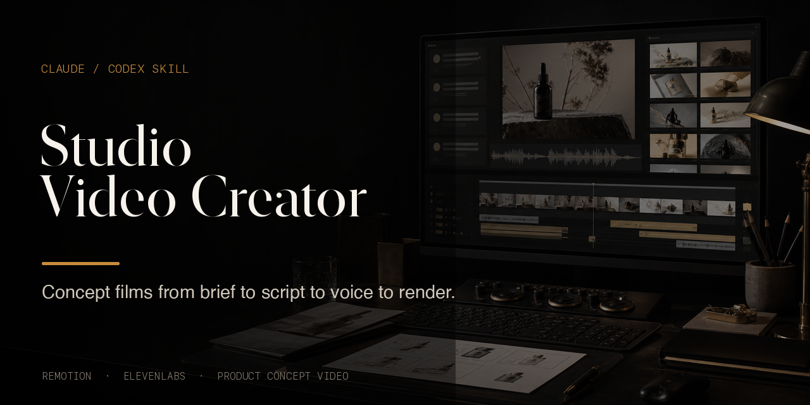
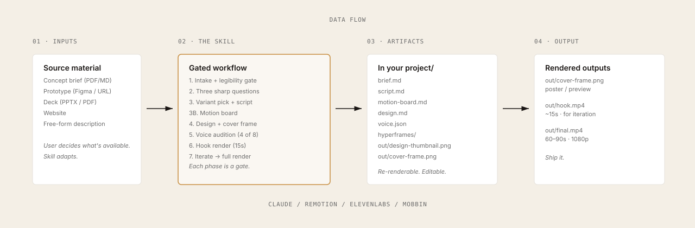

<div align="center">



<br />

[](LICENSE)
[](https://claude.com/skills)
[](https://github.com/heygen-com/hyperframes)
[](https://elevenlabs.io)
[](CHANGELOG.md)

**A Claude skill that produces sixty-to-ninety-second concept films for product concepts, studio projects, and early-stage ventures.**

[Quickstart](#quickstart) · [How it works](#how-it-works) · [Philosophy](#philosophy) · [Examples](docs/EXAMPLES.md) · [Docs](docs/)

</div>

<br />

---

## What this is

A Claude skill, not an app. Drop it in, give it source material — a brief, a prototype, a deck, a URL — and tell Claude you want a concept film. The workflow produces a rendered 60–90 second video, with the first 15 seconds rendered first for fast review.

Studio Video Creator is built for short, voiceover-led concept films: prototype-grounded, insight-led, and designed to make an early product concept easier to understand. It fits the moment when a concept needs to be framed for a team, investor, partner, or launch audience.

It is closer to a thinking artifact than a marketing asset: structured enough to explain the concept, concrete enough to show what the product might become.

<br />

## Why it exists

> **Concept films are won on recognition, not persuasion.**

The viewer should understand the concept quickly enough to respond to the actual idea, not to the ambiguity around it. Many product videos drift into feature lists, generic claims, or visual polish that does not explain the product.

This skill keeps the film anchored in five principles:

- The product is the protagonist's tool, not the protagonist's identity
- The voiceover speaks **to** the viewer, not **at** them
- Real screens, not abstract metaphors
- The music builds; the film lands
- Aspiration is earned through specificity, not asserted through superlatives

The goal is to make that workflow repeatable.

<br />

## How it works

<div align="center">
  
</div>

Seven numbered phases, plus a motion-board gate between script and design. Each one is a checkpoint.

| # | Phase | What happens | Gate |
|---|---|---|---|
| 1 | **Intake** | Claude reads everything you provide and produces a two-sentence concept summary. | You confirm or correct. |
| 2 | **Three sharp questions** | Audience, single insight, vision statement. Skipped if the source answers them. | Brief assembled. |
| 3 | **Variant + script** | Picks one of three structural variants (customer-led / insight-led / demo-led) and writes a 60–90s script. | Script drafted. |
| 3B | **Motion board** | Maps each 5–8s beat to visible action, before/after state, motion mode, and product proof. | Motion board approved. |
| 4 | **Design direction** | Checks for extra visual references, extracts or proposes a visual language, defines the cover-frame strategy, then renders a design thumbnail. | Design thumbnail approved. |
| 5 | **Voice audition** | Four voices from a curated shortlist of eight, each reading the first 10 seconds. | Voice selected. |
| 6 | **Hook render** | The first ~15 seconds are rendered for fast iteration, with frame 0 exported as the cover frame. | Hook delivered. |
| 7 | **Iterate → full render** | Conversational edits. Then the full film. | Film complete. |

The design thumbnail is the aesthetic iteration unit. The hook render is the video iteration unit. The full render comes after the hook is approved.

<br />

## Quickstart

### Prerequisites

- **Claude** with skills support (claude.ai, Claude Code, or any Claude environment that loads skills)
- **Node.js 22+** and **FFmpeg** for rendering locally with HyperFrames
- **ElevenLabs API key** or access to the ElevenLabs Player MCP for voiceover

### Install the skill

**Option A — `.skill` file (recommended):**

Download [`studio-video-creator.skill`](https://github.com/clarkvalberg/studio-video-creator/releases) from the latest release and load it into Claude per [these instructions](docs/INSTALLATION.md).

**Option B — clone and link:**

```bash
git clone https://github.com/clarkvalberg/studio-video-creator.git ~/.claude/skills/studio-video-creator
```

(See [INSTALLATION.md](docs/INSTALLATION.md) for environment-specific paths.)

### Make a film

Open Claude. Attach your source material. Say something like:

> *"Make a concept film from this brief and prototype. Audience is institutional LPs."*

That's it. The skill takes it from there.

<br />

## What you get

```
your-project/
├── brief.md           ← interpreted concept, audience, vision
├── script.md          ← final script with section timing
├── motion-board.md    ← beat-by-beat visual causality plan
├── design.md          ← visual / motion language + cover-frame strategy
├── voice.json         ← selected ElevenLabs voice
├── hyperframes/       ← full HyperFrames project, populated
│   ├── src/
│   └── public/
└── out/
    ├── design-thumbnail.png ← Phase 4 · title-frame style artifact
    ├── cover-frame.png ← Phase 6 · actual frame-0 poster image
    ├── hook.mp4       ← ~15s · round-one deliverable
    └── final.mp4      ← 60–90s · 1080p · ship-ready
```

Everything is editable. Everything is re-renderable. The HyperFrames project is yours — hand it to a designer to refine, swap in higher-fidelity screens, change the voice for a different audience. The design thumbnail is there so the look can be corrected before voice and video render time enter the loop. The cover frame is there so the actual frozen first impression is judged deliberately, not left to frame-0 luck.

<br />

## The eight voices

A curated ElevenLabs shortlist keeps voice selection fast. Claude picks four to audition based on your audience and tone, and surfaces the rest only if you ask.

| Voice | Register | Fit |
|---|---|---|
| **Rachel** | Warm intelligent female | The default — works across most variants |
| **Adam** | Deep grounded male | Gravitas. LP-facing, institutional |
| **Antoni** | Warm conversational male | Peer-to-peer, developer tools |
| **Charlotte** | Emotional intimate female | Customer-led films, healthcare, care services |
| **Brian** | Confident American narrator male | Cinematic, brand-launch register |
| **Lily** | Warm British female | Documentary cadence, editorial sensibility |
| **Daniel** | British authority male | Weighty, regulated industries |
| **Will** | Measured thoughtful male | Insight-led films with a contrarian or sophisticated thesis |

Full personas and matching matrix in [`references/voice-shortlist.md`](references/voice-shortlist.md).

<br />

## The banned words

The script rules steer away from these words because they are overused in product and pitch language. They often make a specific concept feel generic before the viewer can hear the idea.

> `revolutionary` · `game-changing` · `best-in-class` · `cutting-edge` · `next-generation` · `leverage` · `unlock` · `empower` · `seamlessly` · `transformative` *(self-applied)* · `innovative` *(self-applied)* · `synergy` · `holistic` · `robust` · `scalable` *(in pitch context)* · `mission-critical` · `enterprise-grade` · `supercharge` · `AI-powered` *(use a specific verb instead)*

Plus near-banned phrases — *"imagine a world where…"*, *"designed to…"*, *"helps you to…"* — that the skill steers around. The complete list with reasoning lives in [`references/script-rules.md`](references/script-rules.md).

<br />

## Format Principles

The workflow draws from short product concept films and studio videos that combine narration, real product surfaces, and a clear visual arc. It is not tied to a specific studio, campaign, or reference.

The useful pattern is simple:

- Start with a concrete moment, question, or product state
- Explain the concept through visible change, not only narration
- Show real or schematic product surfaces
- Let the voiceover frame the idea without over-selling it
- Land on a specific promise the concept has earned

<br />

## Roadmap

The first release stays deliberately narrow: 60–90 second concept films with a gated hook-render loop. The broader `studio-video-creator` direction is a family of short studio-grade product videos built from the same workflow:

- **Concept film** — current format; source material becomes a voiceover-led pitch film
- **Launch teaser** — shorter public-facing reveal for a product or studio project
- **Investor narrative** — LP/fundraising cut with sharper market and thesis beats
- **Demo montage** — screen-forward product walkthrough with less narration
- **Internal alignment film** — strategy narrative for teams before build or launch

New formats should add structure while preserving the current concept-film workflow.

<br />

## Repository

```
studio-video-creator/
├── SKILL.md                      ← the operating manual (Claude reads this)
├── references/                   ← deep guidance loaded by phase
│   ├── frameworks.md             ← the canonical structure + 3 variants
│   ├── script-rules.md           ← voice, pacing, banned words
│   ├── motion-board.md           ← beat-by-beat visual causality planning
│   ├── voice-shortlist.md        ← the 8 voices with IDs and fit notes
│   ├── design-language.md        ← UI references, brand extraction
│   ├── cover-frame-strategy.md   ← poster-frame archetypes + checks
│   ├── intake-checklist.md       ← what to extract per input type
│   ├── hyperframes-integration.md ← file layout, data shape, render specs
│   └── example-signatures-law.md ← a complete worked example
├── scripts/                      ← executable helpers
│   ├── init-project.sh
│   ├── audition.sh
│   ├── generate-voiceover.sh
│   ├── check-static-video.sh
│   ├── render-design-thumbnail.sh
│   ├── render-hook.sh
│   └── render-full.sh
├── assets/
│   └── hyperframes-template/     ← the rendering layer
│       ├── compositions/
│       │   ├── design-thumbnail.html
│       │   ├── hook.html
│       │   └── full.html
│       ├── data/
│       │   ├── film.json         ← project data contract
│       │   └── tokens.json       ← design token contract
│       └── scripts/
│           └── studio-composition.js
└── docs/                         ← philosophy, workflow, examples
```

<br />

## Documentation

- **[Philosophy](docs/PHILOSOPHY.md)** — scope and design principles
- **[Workflow](docs/WORKFLOW.md)** — the seven phases, in depth
- **Examples** — [Signatures.law video](https://clarkvalberg.github.io/studio-video-creator/) and [worked run](docs/EXAMPLES.md)
- **[Installation](docs/INSTALLATION.md)** — environment setup, troubleshooting
- **[FAQ](docs/FAQ.md)** — questions people actually ask

<br />

## Public Reference

This repository is public for reference and installation. External issues, pull requests, discussions, projects, and wiki are disabled. Internal maintenance happens directly in this repository.

<br />

## License

MIT. See [LICENSE](LICENSE).

<br />

## Built inside Transformative Studio

Transformative Studio builds AI-native vertical ventures.

[transformative.studio](https://transformative.studio) · [@Transformative](https://twitter.com/Transformative)

<br />

<div align="center">

<sub>Hat tip to <a href="https://www.linkedin.com/in/zachary-rabin/">Zach Rabin</a> for the spark that nudged this into public.</sub>

<br />

<sub>Made with care. Use it freely.</sub>

</div>
